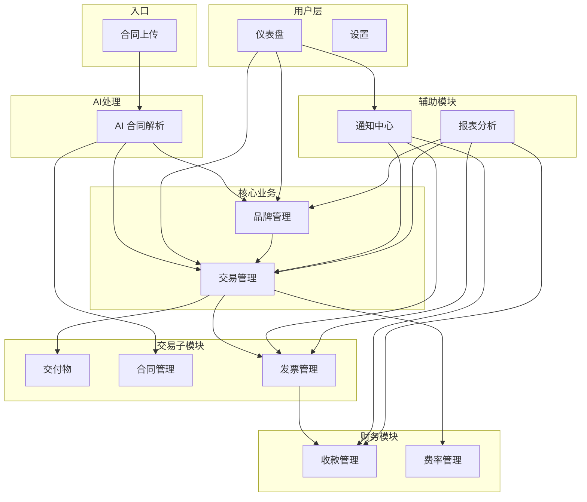
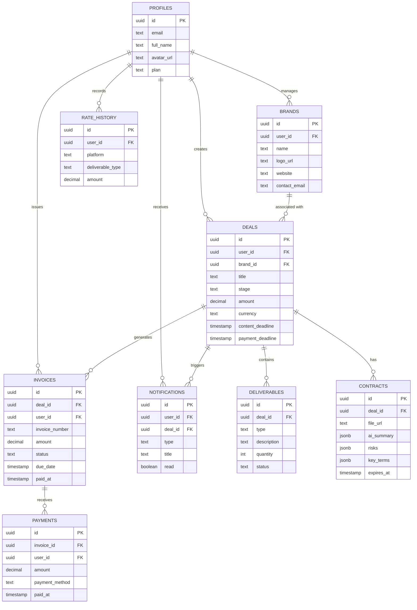

# CreatorDeal 业务架构图

## 1. 核心定位

> **"Upload contract. Get paid."**
> 专为内容创作者打造的 AI 交易管理平台

---

## 2. 合同驱动流程（核心差异化）

### 2.1 用户旅程

```
┌──────────────────────────────────────────────────────────────────────────────────────┐
│                              创作者用户旅程                                          │
└──────────────────────────────────────────────────────────────────────────────────────┘

  品牌联系创作者        创作者收到合同        上传到 CreatorDeal        AI 自动处理
       │                      │                      │                      │
       ▼                      ▼                      ▼                      ▼
  ┌─────────┐          ┌─────────┐          ┌─────────────┐          ┌─────────────┐
  │ Email / │    ──▶   │ PDF /   │    ──▶   │  拖拽上传   │    ──▶   │ AI 提取信息 │
  │ DM 联系 │          │ Word    │          │  或点击上传  │          │ 自动填充    │
  └─────────┘          └─────────┘          └─────────────┘          └─────────────┘
                                                                        │
                                          ┌─────────────────────────────┘
                                          ▼
                              ┌─────────────────────┐
                              │ 自动提取：           │
                              │ • 品牌名称           │
                              │ • 金额/币种          │
                              │ • 内容类型           │
                              │ • 截止日期           │
                              │ • 付款条款           │
                              │ • 使用权限           │
                              └──────────┬──────────┘
                                         │
                          ┌──────────────┴──────────────┐
                          ▼                              ▼
                 ┌─────────────────┐            ┌─────────────────┐
                 │ 用户确认/修正   │            │ 系统自动创建：  │
                 │ 预填充的表单    │     ──▶    │ • 品牌档案      │
                 └─────────────────┘            │ • 交易记录      │
                                                │ • 交付物清单    │
                                                │ • 合同存档      │
                                                └─────────────────┘
                                                          │
                                                          ▼
                                                ┌─────────────────┐
                                                │  交易进入看板   │
                                                │  开始管理流程   │
                                                └─────────────────┘
```

### 2.2 AI 合同解析流程

```
┌──────────────────────────────────────────────────────────────────────────────────────┐
│                              AI 合同解析流程                                          │
└──────────────────────────────────────────────────────────────────────────────────────┘

    ┌─────────────┐
    │  用户上传   │
    │  合同文件   │
    │ (PDF/Word)  │
    └──────┬──────┘
           │
           ▼
    ┌─────────────┐
    │  文件预处理 │
    │  PDF/Word   │
    │  转文本     │
    └──────┬──────┘
           │
           ▼
    ┌─────────────┐
    │  AI 信息提取│
    │  GPT-4 解析 │
    └──────┬──────┘
           │
           ▼
    ┌─────────────────────────────────────────┐
    │           结构化输出                    │
    ├─────────────────────────────────────────┤
    │  字段              │  提取准确率        │
    ├────────────────────┼───────────────────┤
    │  品牌名称          │  ✅ 高 (90%+)     │
    │  金额/币种         │  ✅ 高 (95%+)     │
    │  内容类型          │  ✅ 高 (85%+)     │
    │  截止日期          │  ✅ 高 (90%+)     │
    │  付款条款          │  ⚠️ 中 (80%+)     │
    │  使用权限          │  ⚠️ 中 (75%+)     │
    └─────────────┬───────────────────────────┘
                  │
                  ▼
    ┌─────────────┐
    │  用户确认   │
    │  预填充表单 │
    │  可手动修正 │
    └──────┬──────┘
           │
           ▼
    ┌─────────────┐
    │  创建交易   │
    │  品牌+交付物 │
    │  合同存档   │
    └─────────────┘
```

---

## 3. 模块关系总览



---

## 4. 核心业务流程

### 4.1 交易生命周期

```
┌─────────┐    ┌───────────┐    ┌────────┐    ┌──────────┐    ┌────────┐    ┌───────────┐    ┌──────┐    ┌────────┐
│ Inquiry │ ──▶│ Negotiate │ ──▶│ Signed │ ──▶│ Creating │ ──▶│ Review │ ──▶│ Published │ ──▶│ Paid │ ──▶│ Closed │
│  询价   │    │   谈判    │    │  签约  │    │  制作中  │    │  审核  │    │   已发布  │    │ 已付 │    │  关闭  │
└─────────┘    └───────────┘    └────────┘    └──────────┘    └────────┘    └───────────┘    └──────┘    └────────┘
      │              │              │              │              │              │              │
      ▼              ▼              ▼              ▼              ▼              ▼              ▼
  AI创建交易    确认合作条款    AI提取完成     制作内容      品牌审核      内容上线      收到付款
  (自动填充)    (用户确认)     (合同存档)
```

### 4.2 阶段转换规则

```
┌─────────────────────────────────────────────────────────────────────────────────┐
│                            阶段转换矩阵                                         │
├──────────────┬─────────────────────────────────────────────────────────────────┤
│ 当前阶段      │ 可流转至                                                        │
├──────────────┼─────────────────────────────────────────────────────────────────┤
│ inquiry      │ negotiate, closed                                               │
│ negotiate    │ signed, closed                                                  │
│ signed       │ creating                                                        │
│ creating     │ review                                                          │
│ review       │ published, creating (退回重做)                                  │
│ published    │ paid, closed                                                    │
│ paid         │ closed                                                          │
│ closed       │ (终态，不可流转)                                                │
└──────────────┴─────────────────────────────────────────────────────────────────┘
```

---

## 5. 数据关联关系



---

## 6. 用户操作流程

### 6.1 合同驱动创建（核心流程）

```
┌──────────────────────────────────────────────────────────────────────────────────────┐
│                              合同驱动创建流程（简化版）                              │
└──────────────────────────────────────────────────────────────────────────────────────┘

    ┌─────────────┐
    │  1. 上传    │
    │    合同     │
    └──────┬──────┘
           │
           ▼
    ┌─────────────┐
    │  2. AI 提取 │
    │  自动填充   │
    └──────┬──────┘
           │
           ▼
    ┌─────────────┐
    │  3. 用户    │
    │  确认/修正  │
    └──────┬──────┘
           │
           ▼
    ┌─────────────┐
    │  4. 自动    │
    │  创建交易   │
    └──────┬──────┘
           │
           ▼
    ┌─────────────┐
    │  5. 进入    │
    │  交易看板   │
    └─────────────┘
```

### 6.2 传统创建流程（备选）

```
┌──────────────────────────────────────────────────────────────────────────────────────┐
│                              传统创建流程（手动）                                    │
└──────────────────────────────────────────────────────────────────────────────────────┘

    ┌─────────────┐
    │  1. 创建/   │
    │  选择品牌   │
    └──────┬──────┘
           │
           ▼
    ┌─────────────┐
    │  2. 填写    │
    │  交易信息   │
    └──────┬──────┘
           │
           ▼
    ┌─────────────┐
    │  3. 上传    │
    │    合同     │
    └──────┬──────┘
           │
           ▼
    ┌─────────────┐
    │  4. 进入    │
    │  交易看板   │
    └─────────────┘
```

---

## 7. 通知触发机制

```
┌──────────────────────────────────────────────────────────────────────────────────────┐
│                              通知触发机制                                            │
└──────────────────────────────────────────────────────────────────────────────────────┘

    ┌─────────────────┐                    ┌─────────────────┐
    │  交易创建       │ ──────────────▶   │  通知: 交易已   │
    │  (Deal Create)  │                    │  添加到流水线   │
    └─────────────────┘                    └─────────────────┘

    ┌─────────────────┐                    ┌─────────────────┐
    │  阶段流转       │ ──────────────▶   │  通知: 交易状态 │
    │  (Stage Change) │                    │  已更新         │
    └─────────────────┘                    └─────────────────┘

    ┌─────────────────┐                    ┌─────────────────┐
    │  发票发送       │ ──────────────▶   │  通知: 发票已   │
    │  (Invoice Sent) │                    │  发送           │
    └─────────────────┘                    └─────────────────┘

    ┌─────────────────┐                    ┌─────────────────┐
    │  收款成功       │ ──────────────▶   │  通知: 收到付款 │
    │  (Payment)      │                    │  $XXX           │
    └─────────────────┘                    └─────────────────┘

    ┌─────────────────┐                    ┌─────────────────┐
    │  发票超期       │ ──────────────▶   │  通知: 发票已   │
    │  (Overdue)      │                    │  过期           │
    └─────────────────┘                    └─────────────────┘

    ┌─────────────────┐                    ┌─────────────────┐
    │  截止日期临近   │ ──────────────▶   │  通知: 距离截止 │
    │  (Deadline)     │                    │  还有 X 天      │
    └─────────────────┘                    └─────────────────┘
```

---

## 8. 状态自动流转

```
┌──────────────────────────────────────────────────────────────────────────────────────┐
│                              状态自动流转                                            │
└──────────────────────────────────────────────────────────────────────────────────────┘

    收款完成时:
    ┌─────────────────┐
    │  记录收款       │
    │  (Payments)     │
    └────────┬────────┘
             │
             ▼
    ┌─────────────────┐
    │  更新发票状态   │
    │  draft→paid     │
    │  (Invoices)     │
    └────────┬────────┘
             │
             ▼
    ┌─────────────────┐
    │  更新交易状态   │
    │  published→paid │
    │  (Deals)        │
    └────────┬────────┘
             │
             ▼
    ┌─────────────────┐
    │  创建通知       │
    │  "收到付款"     │
    │  (Notifications)│
    └─────────────────┘


    发票超期时:
    ┌─────────────────┐
    │  系统定时检查   │
    │  (checkOverdue) │
    └────────┬────────┘
             │
             ▼
    ┌─────────────────┐
    │  更新发票状态   │
    │  sent→overdue   │
    │  (Invoices)     │
    └────────┬────────┘
             │
             ▼
    ┌─────────────────┐
    │  创建通知       │
    │  "发票已超期"   │
    │  (Notifications)│
    └─────────────────┘
```
